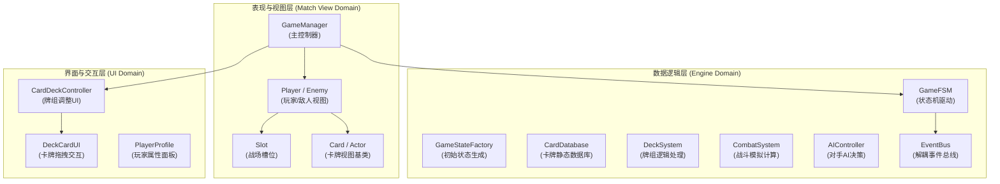
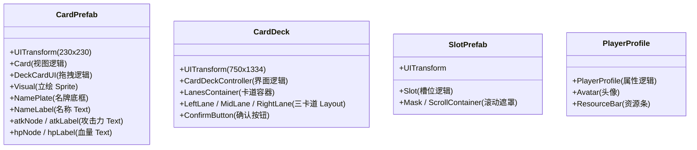

# CardGameTest 项目完整元素分析报告

本报告对 **CardGameTest** 卡牌对战项目进行全面深入的元素剖析，涵盖架构设计、状态机、数据引擎、视图组件、UI 模态框、预制体结构以及场景层级图谱。

---

## 1. 项目整体架构图解



---

## 2. 核心元素分类详解

### 2.1 数据与引擎模块 (`assets/Scripts/Engine/`)

| 文件名 | 职责与作用 | 核心数据结构 / 方法 |
| :--- | :--- | :--- |
| `interfaces.ts` | **全盘数据接口规范** | `IGameState`, `IPlayerState`, `ICardState`, `IStaticCardData`, `ICombatLog`, `GamePhase`, `PlayerSide` |
| `GameFSM.ts` | **有限状态机** | 控制游戏回合阶段流转：`Idle` ➔ `PreBattle` ➔ `DeckAdjustment` ➔ `Rotation` ➔ `Combat` ➔ `TurnEnd` ➔ `GameOver` |
| `EventBus.ts` | **单例事件总线** | `PHASE_CHANGED`, `STATE_UPDATED`, `CARD_MOVED` 等跨模块通信 |
| `CardData.ts` | **静态卡牌数据库** | 包含 5 种卡牌静态数据：`陈庆之(1)`、`岳飞(2)`、`白起(3)`、`吴起(4)`、`孙武(5)` |
| `GameStateFactory.ts` | **状态工厂** | 生成 `createInitialState()` 初始化英雄与 3 条卡道牌组 |
| `DeckSystem.ts` | **牌组系统** | 处理抽牌、发牌、卡道切换与合法性校验 |
| `CombatSystem.ts` | **战斗计算系统** | 模拟卡道对撞输出 `ICombatLog` 战斗日志事件序列 |
| `AIController.ts` | **对手 AI 决策** | 人工智能决策树，处理电脑回合的调牌与转盘确认 |

---

### 2.2 战场视图模块 (`assets/Scripts/Match/`)

| 脚本 / 组件 | 挂载节点 / 位置 | 核心职责与关键属性 |
| :--- | :--- | :--- |
| **`GameManager.ts`** | `MatchManager` 节点 | **全场景调度核心**<br>• 管理 `cardViewPool` 对象池<br>• 监听 `GameFSM` 的 `PHASE_CHANGED` 事件<br>• 调度 `playerView` 与 `opponentView` 更新<br>• 控制 `CardDeck` 弹窗生成与销毁 |
| **`Player.ts`** | `Player` / `Enemy` 节点 | **玩家/敌人视图总控**<br>• `side`: 区分玩家与对手<br>• `heroCard`: 对应英雄卡牌 (`Card`)<br>• `slots`: 对应 3 个卡道槽位 (`Slot[]`)<br>• `resourceLabel`: 资源点数显示 |
| **`Slot.ts`** | `PlayerBoard/Slot_L/M/R` | **战场卡槽**<br>• 托管当前卡道的出战卡牌<br>• 提供转盘滚动动画 (`playScrollAnimation`) |
| **`Actor.ts`** | `CardPrefab` 基类 | **卡牌/角色基类视图**<br>• `nameLabel`: 名牌文本<br>• `attackLabel`: 攻击力文本<br>• `hpLabel`: 血量文本<br>• `visual`: 艺术立绘 `Sprite` |
| **`Card.ts`** | `CardPrefab` 继承类 | **卡牌具体表现类**<br>• 继承 `Actor`<br>• `descriptionLabel`: 技能/描述文本<br>• `resources.load(...)`: 动态加载 `resources/cardPng/...` 立绘 |

---

### 2.3 界面与交互模块 (`assets/Scripts/UI/`)

| 脚本 / 组件 | 挂载节点 / 位置 | 核心职责与交互机制 |
| :--- | :--- | :--- |
| **`CardDeckController.ts`** | `CardDeck.prefab` | **牌组调整全屏界面总控**<br>• 管理左/中/右（`LeftLane`, `MidLane`, `RightLane`）三个卡道容器<br>• 实例化 `cardPrefab` 并缩放（`scale: 0.65`）放入卡道<br>• 监听拖拽落点计算插槽索引（`getInsertionIndex`）<br>• 提交 `DECK_ADJUSTMENT_CONFIRMED` 事件 |
| **`DeckCardUI.ts`** | `CardPrefab` 交互拓展 | **卡牌拖拽交互组件**<br>• 监听 `TOUCH_START`, `TOUCH_MOVE`, `TOUCH_END`, `TOUCH_CANCEL`<br>• 控制卡牌拖拽跟随指针、暂存原父节点与坐标<br>• 触发卡牌跨卡道移动事件 |
| **`PlayerProfile.ts`** | `PlayerProfile.prefab` | **头像与状态面板**<br>• 显示头像、名称、等级与剩余资源 |

---

### 2.4 预制体资源清单 (`assets/Prefabs/`)



---

### 2.5 场景层级图谱 (`assets/Scene/BattleScene.scene`)

```
BattleScene (场景根节点)
├── Main Camera (摄像机)
└── Canvas (UI 根画布, 750 x 1334)
    ├── Background (对战背景图)
    ├── Player (玩家英雄与槽位容器)
    │   └── CardPrefab (玩家英雄卡牌: 岳飞)
    ├── Enemy (敌人英雄与槽位容器)
    │   └── CardPrefab (对手英雄卡牌: 白起)
    ├── Battlefield (战场区域)
    │   ├── PlayerBoard (玩家卡槽: Slot_Left, Slot_Mid, Slot_Right)
    │   └── EnemyBoard (对手卡槽: Slot_Left, Slot_Mid, Slot_Right)
    ├── MatchManager (挂载 GameManager 脚本的主控节点)
    ├── ActionButton (回合阶段确认按钮)
    ├── InfoLabel (回合阶段信息提示文本)
    └── TimerLabel (回合倒计时文本)
```

---

## 3. 卡牌显示与绘制链路总结

```mermaid
sequenceDiagram
    autonumber
    GameManager->>GameFSM: startGame() 启动游戏
    GameFSM-->>GameManager: 触发 PHASE_CHANGED (DeckAdjustment)
    GameManager->>PlayerView: updateView(playerState)
    PlayerView->>CardView: heroCard.updateView(heroState, staticData)
    CardView->>Actor: super.updateView() 赋值 Name/ATK/HP 文本
    CardView->>resources: load(spriteFramePath) 异步装载立绘
    GameManager->>CardDeckController: showDeckAdjustmentUI() 弹出调整界面
    CardDeckController->>DeckCardUI: instantiate(cardPrefab) 实例化士兵卡牌
    DeckCardUI->>CardView: cardComp.updateView(null, staticData) 绘制士兵卡牌
```
